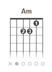
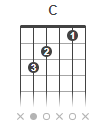
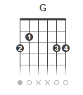
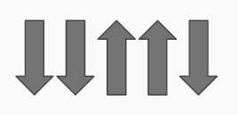
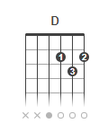

### Escala de DÓ maior

> DÓ - RÉ - MÍ - FÁ - SOL - LÁ - SÍ

### Cifras

Os acordes do violão/guitarra são representados por letras, que chamamos de cifras.

| Cifra | Acorde |
| ------ | ------ |
| C | DÓ |
| D | RÉ |
| E | MÍ |
| F | FÁ |
| G | SOL |
| A | LÁ |
| B | SÍ |

O "m" (m minúsculo) significa _menor_, então "Fm" ler-se "Fá menor", "Dm" ler-se "Ré menor".

### Primeiros acordes

|  |  |  |
| ------ | ------ | ------ |
|  |  |  |

Ritmo

Musicas:

- Am C G

|  |  |
| ------ | ------ |
|  |  |

Musicas:

- G D Em C

### Nome das cordas

As cordas do violão/guitarra se contam de baixo para cima. A 1ª tem o som mais agudo (fino), e a última mais grave (grosso).

| Corda | Nome |
| ------ | ------ |
| 6º | MÍ |
| 5º | LÁ |
| 4º | RÉ |
| 3º | SOL |
| 2º | SÍ |
| 1º | MÍ |