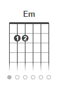

# Parte 1

### Cifras

Os acordes do violão/guitarra são representados por letras, que chamamos de cifras.

| Cifra | Acorde |
| ------ | ------ |
| C | DÓ |
| D | RÉ |
| E | MÍ |
| F | FÁ |
| G | SOL |
| A | LÁ |
| B | SÍ |

O "m" (m minúsculo) significa _menor_, então "Fm" ler-se "Fá menor", "Dm" ler-se "Ré menor".

### Primeiros acordes

|  |  |  |
| ------ | ------ | ------ |
|  |  |  |

Ritmo

Musicas:

- Am C G

|  |  |
| ------ | ------ |
|  |  |

Musicas:

- G D Em C

# Parte 2

Ritmo Valsa 

Músicas:

- F C

|  |  |  |
| ------ | ------ | ------ |
|  |  |  |

|  |
| ------ |
|  |